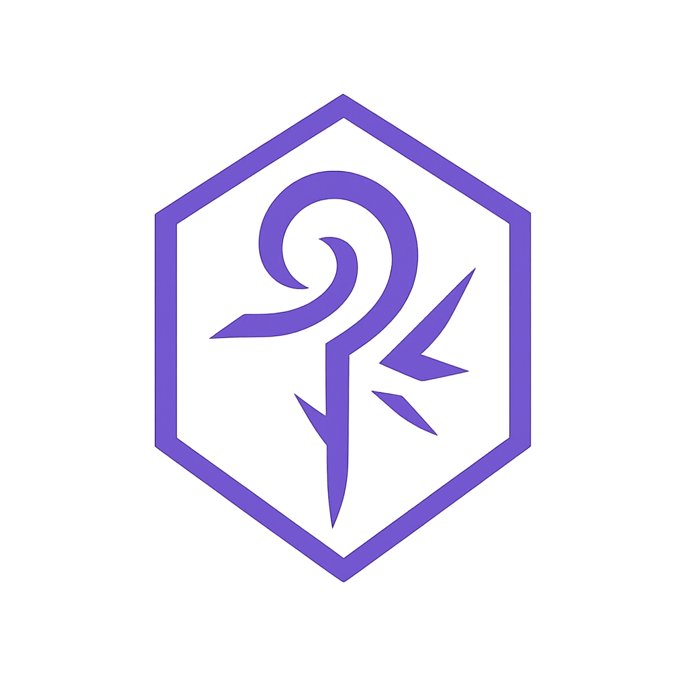

<p align="center">
  
</p>

# QuenUI

[](https://www.npmjs.com/package/@quen-ui/components)

A monorepo with a design system. Contains common components, themes, hooks, and utility utilities for projects.

## Packages
- [`@quen-ui/components`](https://quen-ui.github.io/quen-ui/#/components/alert)
- [`@quen-ui/theme`](https://quen-ui.github.io/quen-ui/#/theming/Introductiontotheming)
- [`@quen-ui/hooks`](https://quen-ui.github.io/quen-ui/#/hooks/useOnClickOutside)
- [`@quen-ui/helpers`](https://quen-ui.github.io/quen-ui/#/helpers/deepMerge)

## Structure

- **packages/components** — UI components (buttons, inputs, modals, etc.).
- **packages/theme** — design system theme: tokens, variables, settings for components.
- **packages/hooks** — custom React hooks used inside components and applications.
- **packages/helpers** — auxiliary functions and utilities that do not depend on React

## Installing dependencies

```bash
npm install
```

## Launching storybook for development

```bash
npm run storybook
```


## [Documentation](https://quen-ui.github.io/quen-ui/)

